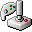
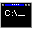

<h1 align="center">Andy Stoll</h1>

  Junior developer · 42 Lausanne · Switzerland

  
  

<table>
  <tr>
    <td><b>profile.exe</b></td>
  </tr>
  <tr>
    <td>
      Junior backend / web developer with a strong interest in clean, useful and well-built software.  
      I like building things, understanding how they really work and making them simpler when possible.  
      42 Lausanne gave me a strong base in C, C++, Unix, parsing, HTTP and Docker. 
    </td>
  </tr>
</table>

<table align="right">
  <tr>
    <td><b>SOUL.md</b></td>
  </tr>
  <tr>
    <td>
      <b>Age:</b> 32 
      <b>Enjoys:</b> reading books, running, walking in the mountains 
      <b>Into:</b> homelabbing, experimenting with AI agents and systems 
    </td>
  </tr>
</table>

<table>
  <tr>
    <td><b>tech_stack.ini</b></td>
  </tr>
  <tr>
    <td>
      

        
        
        
        
        
      

      

        
        
        
        
        
        
      

    </td>
  </tr>
</table>

<table align="right">
  <tr>
    <td><b>in_progress.log</b></td>
  </tr>
  <tr>
    <td>
      <ul>
        <li>Getting better with Python and backend development</li>
        <li>Building cleaner projects with a more real-world structure</li>
        <li>Experimenting with homelab setups, AI agents and automation</li>
        <li>Learning how to make systems simpler, clearer and more useful</li>
      </ul>
    </td>
  </tr>
</table>

<table align="center">
  <tr>
    <td><b>current_direction.md</b></td>
  </tr>
  <tr>
    <td>
      I’m looking for a <b>junior backend or web developer role</b> where I can keep learning, build useful and well-structured projects and grow through real-world experience.
    </td>
  </tr>
</table>

 

<table align="center">
  <tr>
    <td colspan="2"><b>42_cursus</b></td>
  </tr>
  <tr>
    <td width="56" align="center"></td>
    <td><a href="https://github.com/andyst-dev/libft-42"><b>libft-42</b></a> Custom C library reimplementing standard functions, memory utilities and linked-list helpers.</td>
  </tr>
  <tr>
    <td width="56" align="center"></td>
    <td><a href="https://github.com/andyst-dev/ft_printf-42"><b>ft_printf-42</b></a> Reimplementation of <code>printf</code>, focused on formatted output, variadic arguments and modular C design.</td>
  </tr>
  <tr>
    <td width="56" align="center"></td>
    <td><a href="https://github.com/andyst-dev/get_next_line-42"><b>get_next_line-42</b></a> Buffered file-reading project built around line-by-line input handling.</td>
  </tr>
  <tr>
    <td width="56" align="center"></td>
    <td><a href="https://github.com/andyst-dev/minitalk-42"><b>minitalk-42</b></a> Small Unix communication project using signals for inter-process messaging.</td>
  </tr>
  <tr>
    <td width="56" align="center"></td>
    <td><a href="https://github.com/andyst-dev/push_swap-42"><b>push_swap-42</b></a> Algorithmic sorting project focused on optimization and constrained operations.</td>
  </tr>
  <tr>
    <td width="56" align="center"></td>
    <td><a href="https://github.com/andyst-dev/so_long-42"><b>so_long-42</b></a> 2D game in C with map validation, rendering, textures and event handling.</td>
  </tr>
  <tr>
    <td width="56" align="center"></td>
    <td><a href="https://github.com/andyst-dev/philosophers-42"><b>philosophers-42</b></a> Concurrency project based on the dining philosophers problem using threads and mutexes.</td>
  </tr>
  <tr>
    <td width="56" align="center"></td>
    <td><a href="https://github.com/andyst-dev/minishell-42"><b>minishell-42</b></a> Shell project in C with parsing, tokenization, environment management, pipes, redirections and signal handling.</td>
  </tr>
  <tr>
    <td width="56" align="center"></td>
    <td><a href="https://github.com/andyst-dev/cub3d-42"><b>cub3d-42</b></a> Raycasting project in C with map parsing, textures, movement, rotation and a first-person 3D view built with MiniLibX.</td>
  </tr>
</table>

 

<table align="center">
  <tr>
    <td><b>contact.vcf</b></td>
  </tr>
  <tr>
    <td>
      <b>Email :</b> andystoll@proton.me 
    </td>
  </tr>
</table>
