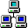

<h1 align="center">Andy</h1>

  Backend &amp; automation developer · 42 Lausanne graduate · Switzerland

  

<table>
  <tr>
    <td><b>profile.exe</b></td>
  </tr>
  <tr>
    <td>
      Backend &amp; automation developer focused on Python, APIs and developer tooling.  
      42 Lausanne graduate with a background in C, C++, Unix, networking and containers. 
      I now build practical tools around FastAPI, TypeScript, automation and AI agents.
    </td>
  </tr>
</table>

<table align="right">
  <tr>
    <td><b>SOUL.md</b></td>
  </tr>
  <tr>
    <td>
      <b>Enjoys:</b> reading books, running, walking in the mountains 
      <b>Into:</b> homelabbing, AI agents, building tools that make life simpler
    </td>
  </tr>
</table>

<table>
  <tr>
    <td><b>tech_stack.ini</b></td>
  </tr>
  <tr>
    <td>
      

        
        
        
        
        
      

      

        
        
        
        
        
        
        
      

    </td>
  </tr>
</table>

<table align="right">
  <tr>
    <td><b>in_progress.log</b></td>
  </tr>
  <tr>
    <td>
      <ul>
        <li>Building a local-first AI assistant for iPhone with multiple model providers, tool calling and native iOS actions</li>
        <li>Packaging ContextLean for easier installation across Codex and Claude Code</li>
        <li>Experimenting with local models, agent workflows and self-hosted automation</li>
      </ul>
    </td>
  </tr>
</table>

 

<table align="center">
  <tr>
    <td colspan="2"><b>~/projects</b></td>
  </tr>
  <tr>
    <td width="56" align="center"></td>
    <td><a href="https://github.com/andyst-dev/contextlean"><b>ContextLean</b></a> Repository context tooling for coding agents. Builds compact project maps for Codex and Claude Code, with audit, review and benchmarking skills.</td>
  </tr>
  <tr>
    <td width="56" align="center"></td>
    <td><a href="https://github.com/andyst-dev/hookrelay"><b>HookRelay</b></a> FastAPI webhook gateway for receiving, validating, transforming, forwarding, retrying and replaying events.</td>
  </tr>
  <tr>
    <td width="56" align="center"></td>
    <td><a href="https://github.com/andyst-dev/flowforge"><b>FlowForge</b></a> Reusable CSV and Excel cleaning workflows with FastAPI, Pandas, SQLite and a browser-based interface.</td>
  </tr>
  <tr>
    <td width="56" align="center"></td>
    <td><a href="https://github.com/andyst-dev/notenest-ai"><b>NoteNest AI</b></a> Next.js app that turns messy notes into structured Markdown folders with metadata, duplicate detection and safe ZIP export.</td>
  </tr>
</table>

 

<table align="center">
  <tr>
    <td colspan="2"><b>42_cursus</b></td>
  </tr>
  <tr>
    <td width="56" align="center"></td>
    <td><a href="https://github.com/andyst-dev/ft_transcendence-42"><b>ft_transcendence-42</b></a> Full-stack TypeScript single-page application built around online Pong: accounts and authentication, a dedicated chat service with socket messaging, tournaments and matchmaking, an nginx HTTPS entry point, with ELK and Prometheus/Grafana in the stack.</td>
  </tr>
  <tr>
    <td width="56" align="center"></td>
    <td><a href="https://github.com/andyst-dev/inception-42"><b>inception-42</b></a> Containerised infrastructure built from individual Dockerfiles: NGINX as the single HTTPS entry point with TLS, WordPress over php-fpm and MariaDB in separate containers, a custom bridge network, persistent volumes and secrets-based provisioning.</td>
  </tr>
  <tr>
    <td width="56" align="center"></td>
    <td><a href="https://github.com/andyst-dev/webserv-42"><b>webserv-42</b></a> HTTP/1.1 server written in C++98: request parsing, response generation, CGI execution, NGINX-style configuration parsing and multiple servers and ports handled through one non-blocking event loop.</td>
  </tr>
  <tr>
    <td width="56" align="center"></td>
    <td><a href="https://github.com/andyst-dev/42-archive"><b>archive-42</b></a> Index of the rest of the cursus, in the order I went through it.</td>
  </tr>
</table>

 

<table align="center">
  <tr>
    <td><b>current_direction.md</b></td>
  </tr>
  <tr>
    <td>
      Available for backend, automation and developer tooling work · Switzerland / Remote
    </td>
  </tr>
</table>
